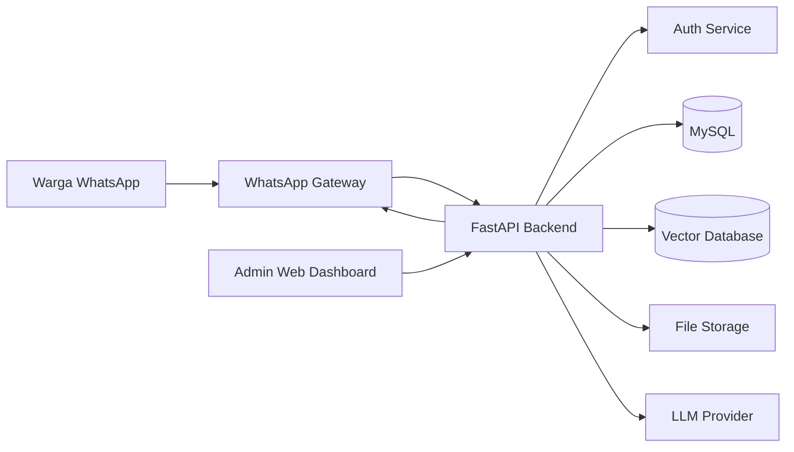
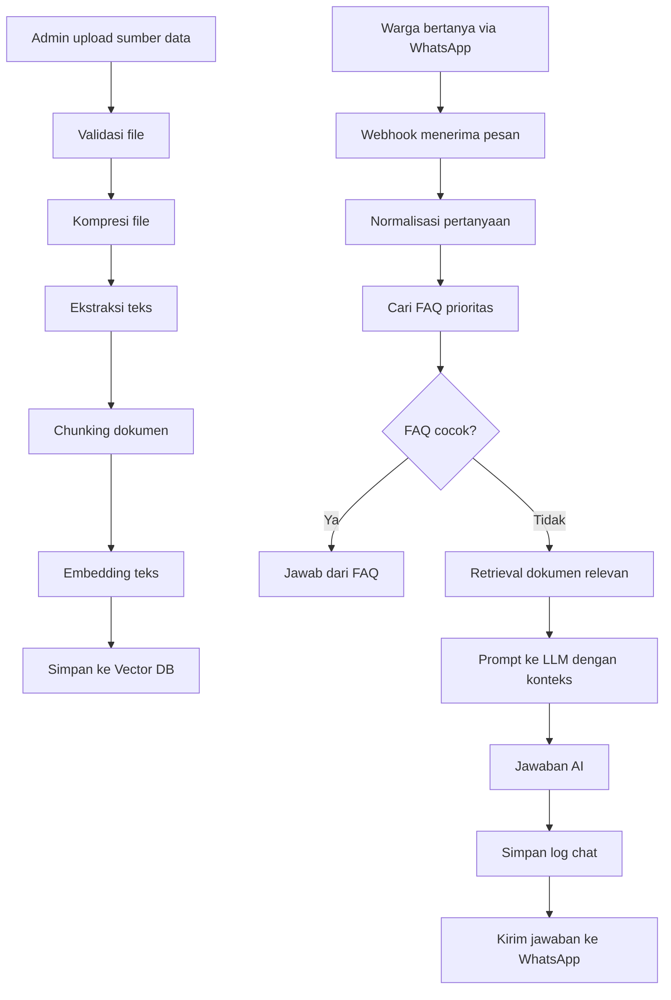
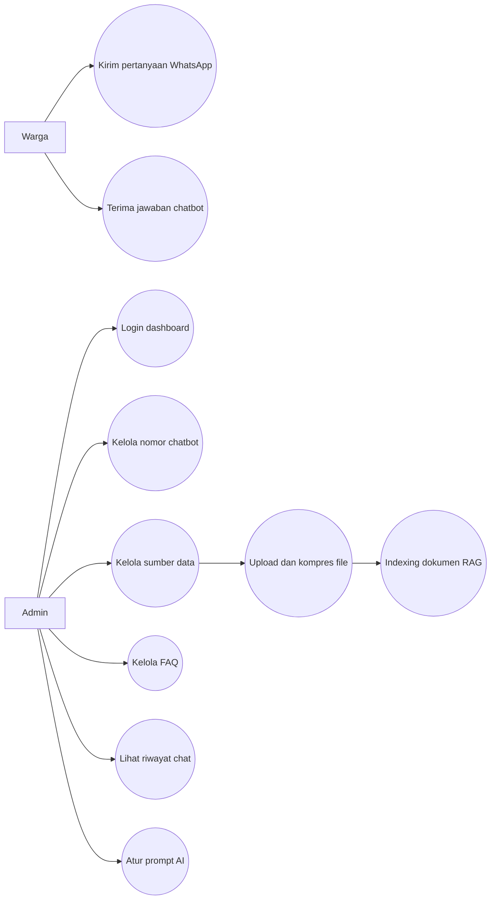
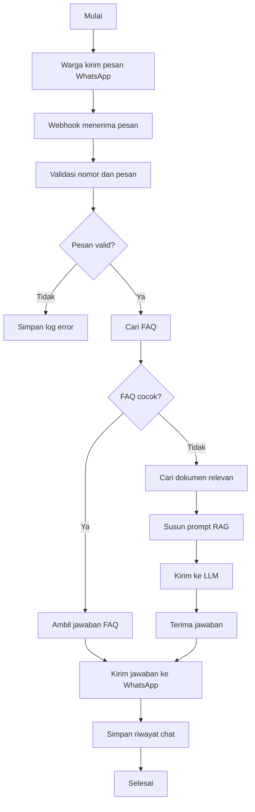
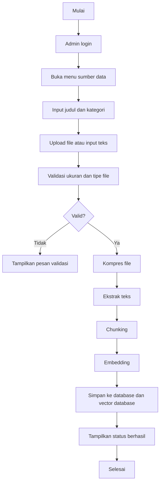
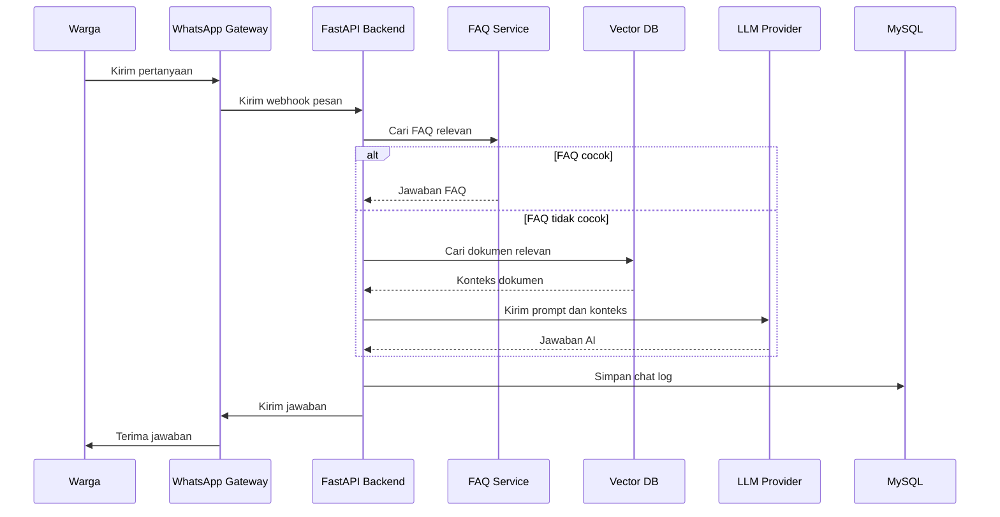
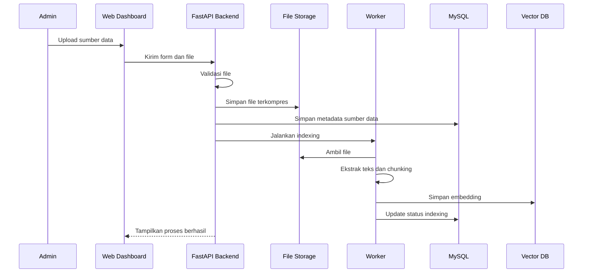
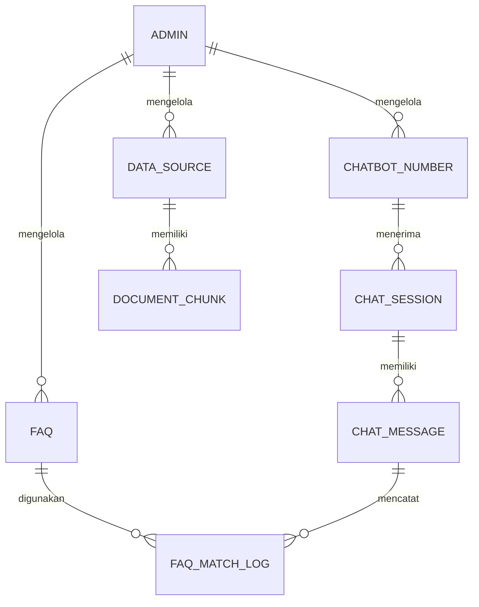
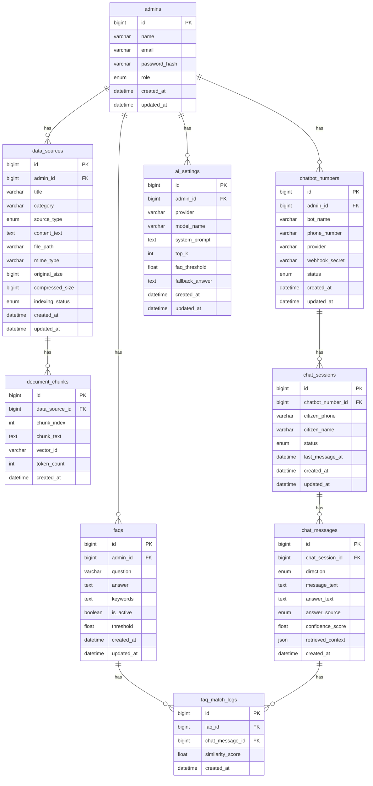

# PRD Chatbot Warga WhatsApp AI RAG LLM

## 1. Ringkasan Produk

Chatbot Warga WhatsApp AI RAG LLM adalah sistem layanan informasi warga berbasis WhatsApp. Warga bertanya melalui WhatsApp. Sistem menjawab otomatis memakai LLM dan RAG berdasarkan sumber data yang dikelola admin.

Admin memakai web dashboard untuk mengatur nomor chatbot, mengelola sumber data, menyiapkan pertanyaan dan jawaban, melihat riwayat chat, dan mengatur status layanan.

Produk ini cocok untuk desa, kelurahan, RW, komunitas warga, layanan administrasi, pengumuman, SOP pelayanan, jadwal kegiatan, dan tanya jawab umum.

## 2. Tujuan Sistem

1. Memudahkan warga mendapat informasi melalui WhatsApp.
2. Mengurangi pertanyaan berulang kepada admin.
3. Menjawab pertanyaan berdasarkan dokumen resmi.
4. Menyediakan dashboard admin yang ringan dan mudah digunakan.
5. Mendukung pengelolaan sumber data secara CRUD.
6. Mendukung FAQ manual untuk pertanyaan penting.
7. Menyediakan sistem yang responsive di HP, tablet, laptop, dan layar besar.
8. Menyediakan perintah run sederhana melalui Docker Compose.

## 3. Batasan Sistem

1. Warga tidak login ke web.
2. Warga hanya memakai WhatsApp untuk input chat.
3. Admin memakai web dashboard.
4. Database MySQL otomatis dibuat melalui Docker Compose.
5. MySQL root tidak memakai password sesuai kebutuhan awal.
6. Sistem tidak memasukkan emotikon di kode.
7. Gambar, video, dan file harus dikompres sebelum disimpan.
8. Jawaban AI harus mengutamakan sumber data yang tersedia.
9. Jika data tidak ditemukan, sistem menjawab bahwa informasi belum tersedia.

## 4. Aktor Sistem

| Aktor | Deskripsi | Akses |
|---|---|---|
| Warga | Pengguna layanan informasi | WhatsApp |
| Admin | Pengelola sistem chatbot | Web dashboard |

## 5. Tech Stack yang Disarankan

### 5.1 Frontend

| Komponen | Teknologi | Alasan |
|---|---|---|
| Framework UI | Next.js | Cocok untuk dashboard modern, routing rapi, dan mudah dikembangkan |
| Bahasa | TypeScript | Lebih aman untuk proyek jangka panjang |
| Styling | Tailwind CSS | Ringan, cepat, responsive |
| UI Component | shadcn/ui | Komponen fleksibel dan bisa dimodifikasi |
| Animasi | Motion Dev | Animasi ringan untuk interaksi dashboard |
| UI Block | Magic UI dan Aceternity UI | Untuk hero, card, table, empty state, dan efek visual dashboard |
| State Management | RTK atau Redux Toolkit | Mengatur state admin, auth, data source, FAQ, dan chat log |
| Form | React Hook Form dan Zod | Validasi form lebih rapi |
| Table | TanStack Table | Cocok untuk CRUD dan log chat |

Catatan sumber: shadcn/ui menyediakan komponen accessible dan sistem distribusi kode untuk membangun component library sendiri. Motion Dev mendukung animasi React, JavaScript, dan Vue untuk UI modern. Context7 membantu mengambil dokumentasi terbaru dan contoh kode berbasis versi. RTK dari rtk-ai berfokus pada proxy CLI untuk mengurangi konsumsi token dalam workflow AI coding.

### 5.2 Backend

| Komponen | Teknologi | Alasan |
|---|---|---|
| API Server | FastAPI | Ringan, cepat, cocok untuk AI dan webhook |
| Bahasa | Python | Ekosistem AI dan RAG kuat |
| ORM | SQLAlchemy | Stabil untuk MySQL |
| Migration | Alembic | Struktur database lebih aman |
| Auth | JWT | Cocok untuk admin dashboard |
| Background Job | Celery atau RQ | Untuk proses embedding, parsing dokumen, dan kompresi file |
| Cache | Redis | Menyimpan session, antrean, dan rate limit |
| Vector Store | ChromaDB atau Qdrant | Menyimpan embedding dokumen |
| LLM Provider | Gemini, OpenAI-compatible API, atau DeepSeek | Fleksibel dan mudah diganti |
| Embedding | sentence-transformers atau API embedding | Mendukung pencarian semantik |
| WhatsApp Gateway | Webhook API WhatsApp atau provider WA API | Menghubungkan WhatsApp dan backend |

### 5.3 Database dan Infrastruktur

| Komponen | Teknologi | Alasan |
|---|---|---|
| Database utama | MySQL | Mudah dipakai dan umum untuk web admin |
| Vector DB | ChromaDB atau Qdrant | Menyimpan vektor dokumen RAG |
| Container | Docker Compose | Run semua service dengan satu perintah |
| File Storage | Local volume | Ringan untuk tahap awal |
| Reverse Proxy | Nginx | Untuk production deployment |

## 6. Arsitektur Sistem



## 7. Alur Kerja RAG



## 8. Kebutuhan Fungsional

### 8.1 Modul Warga melalui WhatsApp

| Kode | Kebutuhan | Prioritas |
|---|---|---|
| F-WA-01 | Warga dapat mengirim pertanyaan melalui WhatsApp | Tinggi |
| F-WA-02 | Sistem menerima pesan dari webhook WhatsApp | Tinggi |
| F-WA-03 | Sistem menjawab pertanyaan dengan FAQ jika pertanyaan cocok | Tinggi |
| F-WA-04 | Sistem menjawab pertanyaan dengan RAG jika FAQ tidak cocok | Tinggi |
| F-WA-05 | Sistem menyimpan riwayat pertanyaan dan jawaban | Tinggi |
| F-WA-06 | Sistem memberi jawaban fallback jika data tidak ditemukan | Tinggi |
| F-WA-07 | Sistem mendukung rate limit agar tidak disalahgunakan | Sedang |
| F-WA-08 | Sistem dapat membedakan percakapan per nomor WhatsApp | Tinggi |

### 8.2 Modul Admin Auth

| Kode | Kebutuhan | Prioritas |
|---|---|---|
| F-AUTH-01 | Admin dapat login | Tinggi |
| F-AUTH-02 | Admin dapat logout | Tinggi |
| F-AUTH-03 | Sistem menyimpan token login admin | Tinggi |
| F-AUTH-04 | Sistem membatasi akses halaman dashboard hanya untuk admin | Tinggi |

### 8.3 Modul Nomor Chatbot

| Kode | Kebutuhan | Prioritas |
|---|---|---|
| F-BOT-01 | Admin dapat menambahkan nomor WhatsApp chatbot | Tinggi |
| F-BOT-02 | Admin dapat mengubah nomor WhatsApp chatbot | Tinggi |
| F-BOT-03 | Admin dapat mengaktifkan atau menonaktifkan nomor chatbot | Tinggi |
| F-BOT-04 | Admin dapat melihat status koneksi nomor chatbot | Sedang |
| F-BOT-05 | Admin dapat mengatur nama chatbot | Sedang |

### 8.4 Modul Sumber Data

| Kode | Kebutuhan | Prioritas |
|---|---|---|
| F-DATA-01 | Admin dapat menambahkan sumber data | Tinggi |
| F-DATA-02 | Admin dapat melihat daftar sumber data | Tinggi |
| F-DATA-03 | Admin dapat mengubah metadata sumber data | Tinggi |
| F-DATA-04 | Admin dapat menghapus sumber data | Tinggi |
| F-DATA-05 | Admin dapat upload file PDF, DOCX, TXT, CSV, gambar, dan video | Sedang |
| F-DATA-06 | Sistem mengompres gambar, video, dan file sebelum menyimpan | Tinggi |
| F-DATA-07 | Sistem mengekstrak teks dari dokumen | Tinggi |
| F-DATA-08 | Sistem membuat chunk dokumen | Tinggi |
| F-DATA-09 | Sistem membuat embedding dan menyimpan ke vector database | Tinggi |
| F-DATA-10 | Admin dapat melihat status indexing | Tinggi |

### 8.5 Modul FAQ

| Kode | Kebutuhan | Prioritas |
|---|---|---|
| F-FAQ-01 | Admin dapat menambahkan pertanyaan dan jawaban | Tinggi |
| F-FAQ-02 | Admin dapat mengubah pertanyaan dan jawaban | Tinggi |
| F-FAQ-03 | Admin dapat menghapus pertanyaan dan jawaban | Tinggi |
| F-FAQ-04 | Admin dapat mengaktifkan atau menonaktifkan FAQ | Tinggi |
| F-FAQ-05 | Sistem mencari FAQ yang paling mirip dengan pertanyaan warga | Tinggi |

### 8.6 Modul Chat Log

| Kode | Kebutuhan | Prioritas |
|---|---|---|
| F-LOG-01 | Admin dapat melihat riwayat chat warga | Tinggi |
| F-LOG-02 | Admin dapat mencari chat berdasarkan nomor, tanggal, dan kata kunci | Sedang |
| F-LOG-03 | Admin dapat melihat sumber jawaban AI | Sedang |
| F-LOG-04 | Admin dapat menandai jawaban tidak sesuai | Sedang |
| F-LOG-05 | Admin dapat mengekspor log ke CSV atau Excel | Rendah |

### 8.7 Modul Pengaturan AI

| Kode | Kebutuhan | Prioritas |
|---|---|---|
| F-AI-01 | Admin dapat memilih provider LLM | Sedang |
| F-AI-02 | Admin dapat mengatur system prompt | Tinggi |
| F-AI-03 | Admin dapat mengatur batas jumlah dokumen retrieval | Sedang |
| F-AI-04 | Admin dapat mengatur threshold FAQ | Sedang |
| F-AI-05 | Admin dapat mengatur jawaban fallback | Tinggi |

## 9. Kebutuhan Non Fungsional

| Kode | Kebutuhan | Target |
|---|---|---|
| NF-01 | Responsive | Berjalan baik di HP, tablet, laptop, dan layar besar |
| NF-02 | Performa dashboard | Halaman utama terbuka kurang dari 3 detik pada koneksi normal |
| NF-03 | Performa jawaban chatbot | Jawaban dikirim kurang dari 10 detik untuk pertanyaan umum |
| NF-04 | Keamanan admin | Dashboard wajib memakai login dan JWT |
| NF-05 | Keamanan webhook | Webhook memakai token atau secret key |
| NF-06 | Validasi file | Sistem menolak file berbahaya dan ukuran berlebihan |
| NF-07 | Kompresi file | Gambar, video, dan file dikompres sebelum disimpan |
| NF-08 | Maintainability | Struktur folder modular dan clean code |
| NF-09 | Observability | Log error backend dan log chat tersimpan |
| NF-10 | Backup | Database dan file storage dapat dibackup |
| NF-11 | Portability | Sistem dapat dijalankan dengan Docker Compose |
| NF-12 | Accessibility | Komponen UI mendukung keyboard navigation dan kontras teks yang baik |

## 10. Use Case Diagram



## 11. Skenario Use Case

### 11.1 Use Case Kirim Pertanyaan WhatsApp

| Item | Isi |
|---|---|
| Aktor | Warga |
| Tujuan | Warga mendapat jawaban dari chatbot |
| Prasyarat | Nomor chatbot aktif |
| Alur utama | Warga mengirim pertanyaan. Webhook menerima pesan. Sistem mencari FAQ. Jika FAQ cocok, sistem mengirim jawaban FAQ. Jika tidak cocok, sistem menjalankan RAG dan LLM. Sistem mengirim jawaban ke WhatsApp. Sistem menyimpan log. |
| Alur alternatif | Jika sumber data tidak tersedia, sistem mengirim jawaban fallback. |
| Output | Jawaban chatbot di WhatsApp |

### 11.2 Use Case Kelola Nomor Chatbot

| Item | Isi |
|---|---|
| Aktor | Admin |
| Tujuan | Admin mengatur nomor yang digunakan sebagai chatbot |
| Prasyarat | Admin sudah login |
| Alur utama | Admin membuka menu nomor chatbot. Admin menambah nomor. Admin mengisi nama bot, nomor, provider, dan status aktif. Sistem menyimpan data. |
| Alur alternatif | Jika nomor sudah dipakai, sistem menampilkan pesan validasi. |
| Output | Nomor chatbot tersimpan |

### 11.3 Use Case Kelola Sumber Data

| Item | Isi |
|---|---|
| Aktor | Admin |
| Tujuan | Admin menambah sumber data untuk RAG |
| Prasyarat | Admin sudah login |
| Alur utama | Admin membuka menu sumber data. Admin mengisi judul dan kategori. Admin upload file atau input teks. Sistem validasi file. Sistem kompres file. Sistem ekstrak teks. Sistem membuat chunk dan embedding. Sistem menyimpan data. |
| Alur alternatif | Jika file tidak valid, sistem menolak upload. |
| Output | Sumber data siap digunakan chatbot |

### 11.4 Use Case Kelola FAQ

| Item | Isi |
|---|---|
| Aktor | Admin |
| Tujuan | Admin menyiapkan pertanyaan dan jawaban prioritas |
| Prasyarat | Admin sudah login |
| Alur utama | Admin membuka menu FAQ. Admin menambah pertanyaan, jawaban, kata kunci, dan status aktif. Sistem menyimpan FAQ. |
| Alur alternatif | Jika pertanyaan kosong, sistem menampilkan validasi. |
| Output | FAQ aktif untuk menjawab warga |

### 11.5 Use Case Lihat Riwayat Chat

| Item | Isi |
|---|---|
| Aktor | Admin |
| Tujuan | Admin memantau percakapan warga |
| Prasyarat | Admin sudah login |
| Alur utama | Admin membuka menu chat log. Sistem menampilkan daftar chat. Admin memfilter data berdasarkan tanggal, nomor, atau kata kunci. |
| Alur alternatif | Jika data kosong, sistem menampilkan empty state. |
| Output | Riwayat chat terlihat di dashboard |

## 12. Activity Diagram

### 12.1 Activity Chat Warga



### 12.2 Activity Admin Upload Sumber Data



## 13. Sequence Diagram

### 13.1 Sequence Chat Warga



### 13.2 Sequence Admin Upload Sumber Data



## 14. CDM Conceptual Data Model



### Entitas CDM

| Entitas | Deskripsi |
|---|---|
| Admin | Pengguna dashboard |
| Chatbot Number | Nomor WhatsApp yang menjadi chatbot |
| Data Source | Sumber data untuk RAG |
| Document Chunk | Potongan dokumen untuk embedding |
| FAQ | Pertanyaan dan jawaban manual |
| Chat Session | Sesi percakapan warga |
| Chat Message | Pesan masuk dan keluar |
| FAQ Match Log | Catatan kecocokan FAQ |
| AI Setting | Pengaturan AI dan prompt |

## 15. LDM Logical Data Model



## 16. PDM Physical Data Model MySQL

### 16.1 Tabel admins

```sql
CREATE TABLE admins (
    id BIGINT UNSIGNED AUTO_INCREMENT PRIMARY KEY,
    name VARCHAR(100) NOT NULL,
    email VARCHAR(150) NOT NULL UNIQUE,
    password_hash VARCHAR(255) NOT NULL,
    role ENUM('admin') NOT NULL DEFAULT 'admin',
    created_at DATETIME NOT NULL DEFAULT CURRENT_TIMESTAMP,
    updated_at DATETIME NOT NULL DEFAULT CURRENT_TIMESTAMP ON UPDATE CURRENT_TIMESTAMP
);
```

### 16.2 Tabel chatbot_numbers

```sql
CREATE TABLE chatbot_numbers (
    id BIGINT UNSIGNED AUTO_INCREMENT PRIMARY KEY,
    admin_id BIGINT UNSIGNED NOT NULL,
    bot_name VARCHAR(100) NOT NULL,
    phone_number VARCHAR(30) NOT NULL UNIQUE,
    provider VARCHAR(100) NOT NULL,
    webhook_secret VARCHAR(255) NOT NULL,
    status ENUM('active', 'inactive') NOT NULL DEFAULT 'inactive',
    created_at DATETIME NOT NULL DEFAULT CURRENT_TIMESTAMP,
    updated_at DATETIME NOT NULL DEFAULT CURRENT_TIMESTAMP ON UPDATE CURRENT_TIMESTAMP,
    CONSTRAINT fk_chatbot_numbers_admin FOREIGN KEY (admin_id) REFERENCES admins(id) ON DELETE CASCADE
);
```

### 16.3 Tabel data_sources

```sql
CREATE TABLE data_sources (
    id BIGINT UNSIGNED AUTO_INCREMENT PRIMARY KEY,
    admin_id BIGINT UNSIGNED NOT NULL,
    title VARCHAR(200) NOT NULL,
    category VARCHAR(100) NULL,
    source_type ENUM('text', 'pdf', 'docx', 'txt', 'csv', 'image', 'video') NOT NULL,
    content_text LONGTEXT NULL,
    file_path VARCHAR(255) NULL,
    mime_type VARCHAR(100) NULL,
    original_size BIGINT UNSIGNED DEFAULT 0,
    compressed_size BIGINT UNSIGNED DEFAULT 0,
    indexing_status ENUM('pending', 'processing', 'completed', 'failed') NOT NULL DEFAULT 'pending',
    created_at DATETIME NOT NULL DEFAULT CURRENT_TIMESTAMP,
    updated_at DATETIME NOT NULL DEFAULT CURRENT_TIMESTAMP ON UPDATE CURRENT_TIMESTAMP,
    CONSTRAINT fk_data_sources_admin FOREIGN KEY (admin_id) REFERENCES admins(id) ON DELETE CASCADE
);
```

### 16.4 Tabel document_chunks

```sql
CREATE TABLE document_chunks (
    id BIGINT UNSIGNED AUTO_INCREMENT PRIMARY KEY,
    data_source_id BIGINT UNSIGNED NOT NULL,
    chunk_index INT NOT NULL,
    chunk_text TEXT NOT NULL,
    vector_id VARCHAR(150) NOT NULL,
    token_count INT DEFAULT 0,
    created_at DATETIME NOT NULL DEFAULT CURRENT_TIMESTAMP,
    CONSTRAINT fk_document_chunks_data_source FOREIGN KEY (data_source_id) REFERENCES data_sources(id) ON DELETE CASCADE,
    INDEX idx_document_chunks_vector_id (vector_id)
);
```

### 16.5 Tabel faqs

```sql
CREATE TABLE faqs (
    id BIGINT UNSIGNED AUTO_INCREMENT PRIMARY KEY,
    admin_id BIGINT UNSIGNED NOT NULL,
    question VARCHAR(255) NOT NULL,
    answer TEXT NOT NULL,
    keywords TEXT NULL,
    is_active BOOLEAN NOT NULL DEFAULT TRUE,
    threshold FLOAT NOT NULL DEFAULT 0.80,
    created_at DATETIME NOT NULL DEFAULT CURRENT_TIMESTAMP,
    updated_at DATETIME NOT NULL DEFAULT CURRENT_TIMESTAMP ON UPDATE CURRENT_TIMESTAMP,
    CONSTRAINT fk_faqs_admin FOREIGN KEY (admin_id) REFERENCES admins(id) ON DELETE CASCADE,
    FULLTEXT INDEX ft_faq_question_keywords (question, keywords)
);
```

### 16.6 Tabel chat_sessions

```sql
CREATE TABLE chat_sessions (
    id BIGINT UNSIGNED AUTO_INCREMENT PRIMARY KEY,
    chatbot_number_id BIGINT UNSIGNED NOT NULL,
    citizen_phone VARCHAR(30) NOT NULL,
    citizen_name VARCHAR(100) NULL,
    status ENUM('active', 'closed') NOT NULL DEFAULT 'active',
    last_message_at DATETIME NULL,
    created_at DATETIME NOT NULL DEFAULT CURRENT_TIMESTAMP,
    updated_at DATETIME NOT NULL DEFAULT CURRENT_TIMESTAMP ON UPDATE CURRENT_TIMESTAMP,
    CONSTRAINT fk_chat_sessions_chatbot_number FOREIGN KEY (chatbot_number_id) REFERENCES chatbot_numbers(id) ON DELETE CASCADE,
    INDEX idx_chat_sessions_phone (citizen_phone)
);
```

### 16.7 Tabel chat_messages

```sql
CREATE TABLE chat_messages (
    id BIGINT UNSIGNED AUTO_INCREMENT PRIMARY KEY,
    chat_session_id BIGINT UNSIGNED NOT NULL,
    direction ENUM('incoming', 'outgoing') NOT NULL,
    message_text TEXT NULL,
    answer_text TEXT NULL,
    answer_source ENUM('faq', 'rag', 'fallback', 'system') NOT NULL DEFAULT 'system',
    confidence_score FLOAT NULL,
    retrieved_context JSON NULL,
    created_at DATETIME NOT NULL DEFAULT CURRENT_TIMESTAMP,
    CONSTRAINT fk_chat_messages_session FOREIGN KEY (chat_session_id) REFERENCES chat_sessions(id) ON DELETE CASCADE,
    INDEX idx_chat_messages_created_at (created_at)
);
```

### 16.8 Tabel faq_match_logs

```sql
CREATE TABLE faq_match_logs (
    id BIGINT UNSIGNED AUTO_INCREMENT PRIMARY KEY,
    faq_id BIGINT UNSIGNED NOT NULL,
    chat_message_id BIGINT UNSIGNED NOT NULL,
    similarity_score FLOAT NOT NULL,
    created_at DATETIME NOT NULL DEFAULT CURRENT_TIMESTAMP,
    CONSTRAINT fk_faq_match_logs_faq FOREIGN KEY (faq_id) REFERENCES faqs(id) ON DELETE CASCADE,
    CONSTRAINT fk_faq_match_logs_message FOREIGN KEY (chat_message_id) REFERENCES chat_messages(id) ON DELETE CASCADE
);
```

### 16.9 Tabel ai_settings

```sql
CREATE TABLE ai_settings (
    id BIGINT UNSIGNED AUTO_INCREMENT PRIMARY KEY,
    admin_id BIGINT UNSIGNED NOT NULL,
    provider VARCHAR(100) NOT NULL DEFAULT 'gemini',
    model_name VARCHAR(100) NOT NULL,
    system_prompt TEXT NOT NULL,
    top_k INT NOT NULL DEFAULT 5,
    faq_threshold FLOAT NOT NULL DEFAULT 0.80,
    fallback_answer TEXT NOT NULL,
    created_at DATETIME NOT NULL DEFAULT CURRENT_TIMESTAMP,
    updated_at DATETIME NOT NULL DEFAULT CURRENT_TIMESTAMP ON UPDATE CURRENT_TIMESTAMP,
    CONSTRAINT fk_ai_settings_admin FOREIGN KEY (admin_id) REFERENCES admins(id) ON DELETE CASCADE
);
```

## 17. Rancangan Struktur Folder

```txt
chatbot-warga-rag/
├── apps/
│   ├── web/
│   │   ├── app/
│   │   │   ├── login/
│   │   │   ├── dashboard/
│   │   │   ├── chatbot-number/
│   │   │   ├── data-source/
│   │   │   ├── faq/
│   │   │   ├── chat-log/
│   │   │   └── settings/
│   │   ├── components/
│   │   │   ├── ui/
│   │   │   ├── layout/
│   │   │   ├── forms/
│   │   │   └── dashboard/
│   │   ├── lib/
│   │   ├── store/
│   │   ├── hooks/
│   │   └── public/
│   └── api/
│       ├── app/
│       │   ├── main.py
│       │   ├── core/
│       │   ├── auth/
│       │   ├── chatbot_numbers/
│       │   ├── data_sources/
│       │   ├── faq/
│       │   ├── chat/
│       │   ├── rag/
│       │   ├── ai/
│       │   ├── whatsapp/
│       │   └── workers/
│       ├── migrations/
│       └── requirements.txt
├── docker/
│   ├── mysql/
│   ├── nginx/
│   └── scripts/
├── storage/
│   ├── uploads/
│   ├── compressed/
│   └── logs/
├── vector_store/
├── docker-compose.yml
├── Makefile
├── .env.example
└── README.md
```

## 18. Rancangan Docker Compose

```yaml
services:
  mysql:
    image: mysql:8.4
    container_name: chatbot_warga_mysql
    environment:
      MYSQL_ALLOW_EMPTY_PASSWORD: "yes"
      MYSQL_DATABASE: chatbot_warga
    ports:
      - "3306:3306"
    volumes:
      - mysql_data:/var/lib/mysql
      - ./docker/mysql/init:/docker-entrypoint-initdb.d

  redis:
    image: redis:7-alpine
    container_name: chatbot_warga_redis
    ports:
      - "6379:6379"

  vector-db:
    image: chromadb/chroma:latest
    container_name: chatbot_warga_chroma
    ports:
      - "8001:8000"
    volumes:
      - chroma_data:/chroma/chroma

  api:
    build: ./apps/api
    container_name: chatbot_warga_api
    env_file:
      - .env
    depends_on:
      - mysql
      - redis
      - vector-db
    ports:
      - "8000:8000"
    volumes:
      - ./storage:/app/storage

  web:
    build: ./apps/web
    container_name: chatbot_warga_web
    env_file:
      - .env
    depends_on:
      - api
    ports:
      - "3000:3000"

volumes:
  mysql_data:
  chroma_data:
```

## 19. Perintah Run Satu Perintah

### Opsi Makefile

```makefile
up:
	docker compose up --build

down:
	docker compose down

fresh:
	docker compose down -v
	docker compose up --build
```

Perintah menjalankan sistem:

```bash
make up
```

Perintah menghentikan sistem:

```bash
make down
```

### Opsi tanpa Makefile

```bash
docker compose up --build
```

## 20. Rancangan Environment

```env
APP_NAME=Chatbot Warga RAG
APP_ENV=local
APP_URL=http://localhost:3000
API_URL=http://localhost:8000

MYSQL_HOST=mysql
MYSQL_PORT=3306
MYSQL_DATABASE=chatbot_warga
MYSQL_USER=root
MYSQL_PASSWORD=

REDIS_URL=redis://redis:6379/0
CHROMA_HOST=vector-db
CHROMA_PORT=8000

JWT_SECRET=change_this_secret
WEBHOOK_SECRET=change_this_webhook_secret

LLM_PROVIDER=gemini
LLM_MODEL=gemini-1.5-flash
LLM_API_KEY=change_this_key

MAX_UPLOAD_MB=25
IMAGE_MAX_WIDTH=1600
VIDEO_MAX_WIDTH=1280
```

## 21. Rancangan Halaman Admin

### 21.1 Login

Komponen utama:

1. Form email.
2. Form password.
3. Tombol login.
4. Validasi input.
5. Error state jika login gagal.

### 21.2 Dashboard

Komponen utama:

1. Total chat hari ini.
2. Total pertanyaan dijawab FAQ.
3. Total pertanyaan dijawab RAG.
4. Total sumber data aktif.
5. Status nomor chatbot.
6. Grafik chat per hari.
7. Tabel pertanyaan terbaru.

### 21.3 Nomor Chatbot

Komponen utama:

1. Tabel nomor chatbot.
2. Tombol tambah nomor.
3. Form nama bot.
4. Form nomor WhatsApp.
5. Form provider.
6. Status aktif atau nonaktif.
7. Webhook secret.

### 21.4 Sumber Data

Komponen utama:

1. Tabel sumber data.
2. Upload file.
3. Input teks manual.
4. Kategori data.
5. Status indexing.
6. Ukuran file asli.
7. Ukuran file setelah kompresi.
8. Tombol re-index.
9. Tombol edit.
10. Tombol hapus.

### 21.5 FAQ

Komponen utama:

1. Tabel FAQ.
2. Form pertanyaan.
3. Form jawaban.
4. Form kata kunci.
5. Threshold kecocokan.
6. Status aktif.

### 21.6 Chat Log

Komponen utama:

1. Tabel chat.
2. Filter tanggal.
3. Filter nomor warga.
4. Filter sumber jawaban.
5. Detail konteks RAG.
6. Penanda jawaban tidak sesuai.

### 21.7 Pengaturan AI

Komponen utama:

1. Provider LLM.
2. Nama model.
3. System prompt.
4. Top K retrieval.
5. Threshold FAQ.
6. Jawaban fallback.

## 22. Prinsip UI UX

1. Gunakan sidebar untuk desktop.
2. Gunakan bottom navigation atau drawer untuk mobile.
3. Gunakan table responsive dengan horizontal scroll di HP.
4. Gunakan card ringkas untuk dashboard mobile.
5. Gunakan skeleton loading untuk data tabel.
6. Gunakan empty state saat data kosong.
7. Gunakan dialog konfirmasi untuk hapus data.
8. Gunakan badge untuk status aktif, gagal, processing, dan completed.
9. Gunakan motion hanya untuk transisi penting.
10. Hindari animasi berlebihan agar dashboard tetap ringan.

## 23. Kompresi Gambar, Video, dan File

### 23.1 Gambar

Rekomendasi:

1. Format output WebP.
2. Maksimal lebar 1600 px.
3. Quality 70 sampai 80.
4. Hapus metadata gambar.

Library backend:

```txt
Pillow
```

### 23.2 Video

Rekomendasi:

1. Format output MP4.
2. Codec H.264.
3. Maksimal lebar 1280 px.
4. Gunakan bitrate rendah untuk file informasi.

Tool backend:

```txt
ffmpeg
```

### 23.3 Dokumen

Rekomendasi:

1. Batasi ukuran upload.
2. Simpan file asli hanya jika diperlukan.
3. Ekstrak teks lalu simpan teks bersih.
4. Simpan hasil chunk ke database.
5. Hindari menyimpan duplikasi file besar.

## 24. API Endpoint Awal

| Method | Endpoint | Fungsi | Role |
|---|---|---|---|
| POST | /api/auth/login | Login admin | Admin |
| POST | /api/auth/logout | Logout admin | Admin |
| GET | /api/dashboard/summary | Ringkasan dashboard | Admin |
| GET | /api/chatbot-numbers | List nomor chatbot | Admin |
| POST | /api/chatbot-numbers | Tambah nomor chatbot | Admin |
| PUT | /api/chatbot-numbers/{id} | Update nomor chatbot | Admin |
| DELETE | /api/chatbot-numbers/{id} | Hapus nomor chatbot | Admin |
| GET | /api/data-sources | List sumber data | Admin |
| POST | /api/data-sources | Tambah sumber data | Admin |
| PUT | /api/data-sources/{id} | Update sumber data | Admin |
| DELETE | /api/data-sources/{id} | Hapus sumber data | Admin |
| POST | /api/data-sources/{id}/reindex | Index ulang sumber data | Admin |
| GET | /api/faqs | List FAQ | Admin |
| POST | /api/faqs | Tambah FAQ | Admin |
| PUT | /api/faqs/{id} | Update FAQ | Admin |
| DELETE | /api/faqs/{id} | Hapus FAQ | Admin |
| GET | /api/chat-logs | List chat log | Admin |
| GET | /api/settings/ai | Detail pengaturan AI | Admin |
| PUT | /api/settings/ai | Update pengaturan AI | Admin |
| POST | /api/webhook/whatsapp | Terima webhook WhatsApp | Public dengan secret |

## 25. Prompt Dasar AI

```txt
Anda adalah chatbot layanan warga.
Jawab pertanyaan warga dengan bahasa Indonesia yang jelas, singkat, dan sopan.
Gunakan hanya informasi dari konteks yang diberikan.
Jika informasi tidak ada dalam konteks, jawab bahwa informasi belum tersedia di sistem.
Jangan mengarang data.
Jangan menampilkan detail teknis sistem kepada warga.
```

## 26. Aturan Jawaban Chatbot

1. Jawaban harus singkat.
2. Jawaban harus memakai bahasa Indonesia yang mudah dipahami.
3. Jawaban harus berdasarkan FAQ atau dokumen RAG.
4. Jika pertanyaan di luar data, sistem memberi fallback.
5. Jika pertanyaan meminta kontak admin, sistem memberi kontak resmi jika ada di data.
6. Jika pertanyaan mengandung spam, sistem dapat membatasi respons.

## 27. Validasi dan Keamanan

1. Admin wajib login.
2. Password disimpan sebagai hash.
3. Webhook memakai secret token.
4. File upload dibatasi ukuran dan tipe.
5. Input form divalidasi di frontend dan backend.
6. API memakai rate limit.
7. Log error tidak menampilkan API key.
8. API key LLM hanya disimpan di environment.
9. Role warga tidak memiliki akses dashboard.
10. Data nomor warga tidak ditampilkan sembarangan.

## 28. Testing yang Dibutuhkan

### 28.1 Unit Testing

| Modul | Test |
|---|---|
| Auth | Login valid dan login gagal |
| FAQ | CRUD FAQ |
| Data Source | Validasi file dan metadata |
| RAG | Chunking dan retrieval |
| WhatsApp | Parsing webhook |
| Compression | Kompres gambar dan video |

### 28.2 Integration Testing

| Integrasi | Test |
|---|---|
| Web ke API | Admin menambah FAQ dari dashboard |
| API ke MySQL | Data tersimpan sesuai skema |
| API ke Vector DB | Chunk tersimpan sebagai embedding |
| Webhook ke AI | Pesan warga dijawab sistem |
| Worker ke File Storage | File diproses dan status berubah |

### 28.3 Functional Testing

| Fitur | Skenario |
|---|---|
| Login | Admin login dengan email dan password benar |
| Nomor Chatbot | Admin menambah nomor baru |
| Sumber Data | Admin upload dokumen dan status indexing completed |
| FAQ | Admin menambah pertanyaan dan jawaban |
| Chatbot | Warga bertanya dan menerima jawaban |
| Chat Log | Admin memfilter riwayat chat |

### 28.4 User Acceptance Testing

| Aktor | Skenario | Kriteria Berhasil |
|---|---|---|
| Admin | Mengelola FAQ | FAQ tersimpan dan aktif |
| Admin | Upload sumber data | Dokumen bisa dipakai chatbot |
| Warga | Bertanya via WhatsApp | Jawaban diterima sesuai data |
| Admin | Melihat log chat | Riwayat tampil sesuai filter |

## 29. Opsi Eksekusi Pengembangan

### Opsi 1 Backend dan Database Terlebih Dahulu

Fokus:

1. Setup Docker Compose.
2. Setup MySQL tanpa password root.
3. Setup FastAPI.
4. Buat migration database.
5. Buat API Auth.
6. Buat API CRUD FAQ.
7. Buat API CRUD sumber data.
8. Buat webhook WhatsApp.
9. Buat pipeline RAG.

Kelebihan:

1. Fondasi sistem kuat.
2. Integrasi AI bisa diuji lebih awal.
3. Cocok jika prioritas utama adalah chatbot berjalan.

Kekurangan:

1. Tampilan dashboard belum terlihat di awal.
2. Stakeholder sulit menilai desain produk pada tahap awal.

### Opsi 2 Fullstack Bertahap per Modul

Fokus:

1. Modul auth dibuat dari backend sampai frontend.
2. Modul nomor chatbot dibuat dari backend sampai frontend.
3. Modul FAQ dibuat dari backend sampai frontend.
4. Modul sumber data dibuat dari backend sampai frontend.
5. Modul chat log dibuat dari backend sampai frontend.
6. Modul RAG dan WhatsApp dibuat setelah CRUD siap.

Kelebihan:

1. Setiap modul cepat terlihat hasilnya.
2. Bug lebih mudah dilacak.
3. Cocok untuk pengembangan tim kecil.

Kekurangan:

1. Butuh disiplin struktur folder.
2. Integrasi RAG bisa tertunda.

### Opsi 3 Frontend Terlebih Dahulu

Fokus:

1. Membuat desain UI dashboard responsive.
2. Membuat layout login.
3. Membuat layout dashboard.
4. Membuat halaman nomor chatbot.
5. Membuat halaman sumber data.
6. Membuat halaman FAQ.
7. Membuat halaman chat log.
8. Membuat halaman pengaturan AI.
9. Menggunakan mock data sementara.
10. Setelah UI disetujui, backend dibuat mengikuti kebutuhan UI.

Kelebihan:

1. Tampilan produk cepat terlihat.
2. Cocok untuk validasi UI UX.
3. Admin dapat menilai alur kerja lebih awal.
4. Komponen shadcn/ui, Tailwind CSS, Motion Dev, Magic UI, dan Aceternity UI bisa dirapikan sejak awal.

Kekurangan:

1. Data masih mock pada tahap awal.
2. Perlu penyesuaian saat API backend selesai.

Rekomendasi eksekusi: gunakan Opsi 3 jika tujuan awal adalah membuat tampilan profesional, responsive, dan siap dipresentasikan. Setelah itu lanjutkan backend, database, RAG, dan webhook WhatsApp.

## 30. Roadmap Eksekusi Opsi 3

### Tahap 1 Setup Frontend

1. Buat project Next.js TypeScript.
2. Pasang Tailwind CSS.
3. Pasang shadcn/ui.
4. Pasang Motion Dev.
5. Siapkan komponen layout.
6. Siapkan theme dashboard.
7. Siapkan RTK atau Redux Toolkit.

### Tahap 2 Desain Halaman Admin

1. Login page.
2. Dashboard overview.
3. Chatbot number page.
4. Data source page.
5. FAQ page.
6. Chat log page.
7. AI settings page.

### Tahap 3 Mock Data dan Interaksi

1. Mock data dashboard summary.
2. Mock data chatbot number.
3. Mock data data source.
4. Mock data FAQ.
5. Mock data chat log.
6. Form tambah, edit, hapus memakai state lokal.

### Tahap 4 Backend dan API

1. Setup FastAPI.
2. Setup MySQL.
3. Setup migration.
4. Setup endpoint auth.
5. Setup endpoint CRUD.
6. Hubungkan frontend ke API.

### Tahap 5 RAG dan WhatsApp

1. Setup vector database.
2. Setup embedding.
3. Setup chunking.
4. Setup retrieval.
5. Setup LLM provider.
6. Setup webhook WhatsApp.
7. Testing end-to-end.

## 31. Perintah Setup Skill dan Tooling AI Coding

Gunakan perintah berikut pada root project jika tooling tersedia di environment pengembangan.

```bash
npx ctx7 setup
npx skills add jakubkrehel/make-interfaces-feel-better
```

Tambahkan referensi skill berikut pada workflow AI coding:

```txt
https://juliusbrussee.github.io/caveman/
https://github.com/obra/superpowers
https://skillsllm.com/skill/ui-ux-pro-max-skill
https://github.com/rtk-ai/rtk
```

## 32. Definition of Done

1. Sistem bisa dijalankan dengan satu perintah.
2. MySQL otomatis tersedia dari Docker Compose.
3. Admin bisa login ke dashboard.
4. Admin bisa CRUD nomor chatbot.
5. Admin bisa CRUD sumber data.
6. Admin bisa CRUD FAQ.
7. Admin bisa melihat chat log.
8. Webhook WhatsApp bisa menerima pesan.
9. Sistem bisa menjawab dari FAQ.
10. Sistem bisa menjawab dari RAG dan LLM.
11. File gambar, video, dan dokumen dikompres sebelum disimpan.
12. UI responsive di HP, tablet, laptop, dan layar besar.
13. Kode tidak memasukkan emotikon.
14. Dokumentasi setup tersedia di README.

## 33. Sumber Referensi Teknis

1. shadcn/ui digunakan sebagai dasar komponen UI yang accessible dan bisa dimodifikasi.
2. Motion Dev digunakan untuk animasi React yang ringan dan production-grade.
3. Context7 digunakan untuk mengambil dokumentasi terbaru dan contoh kode berbasis versi untuk coding assistant.
4. RTK dari rtk-ai digunakan sebagai referensi tool CLI untuk efisiensi token pada workflow AI coding.
