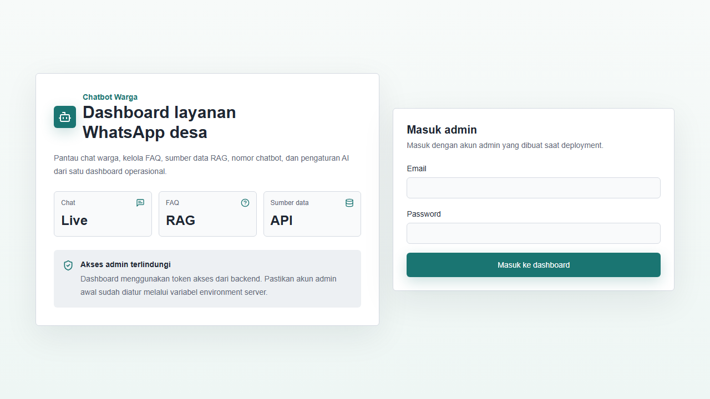
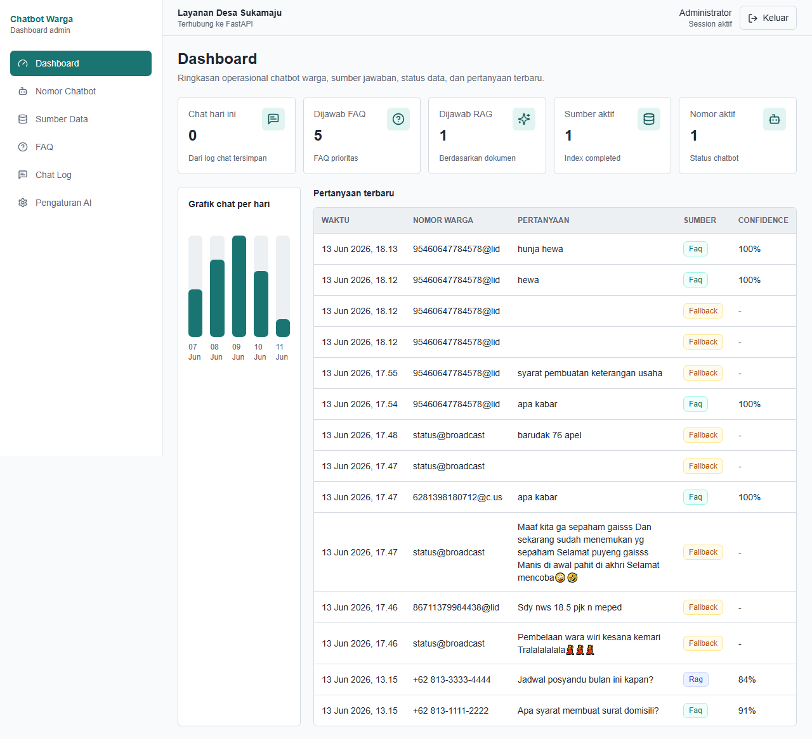
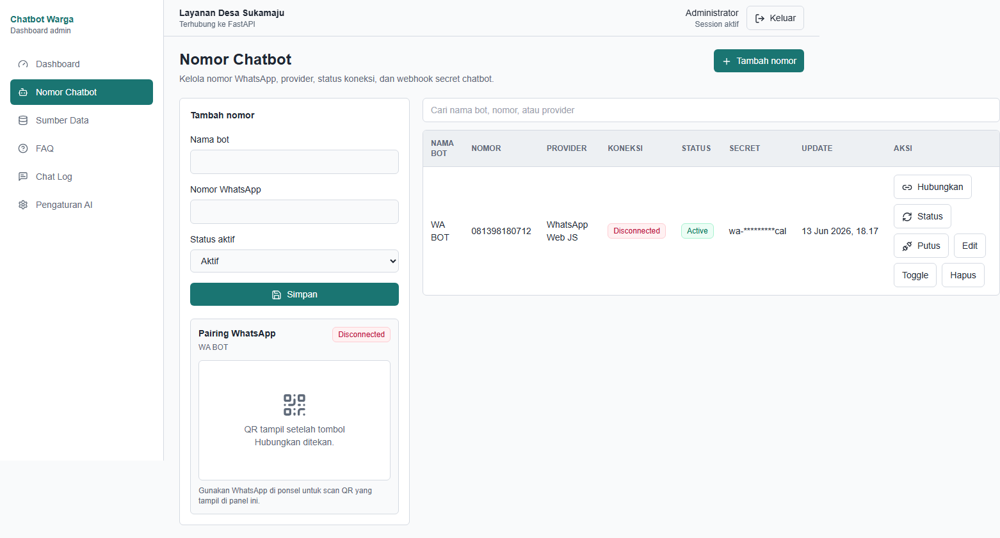
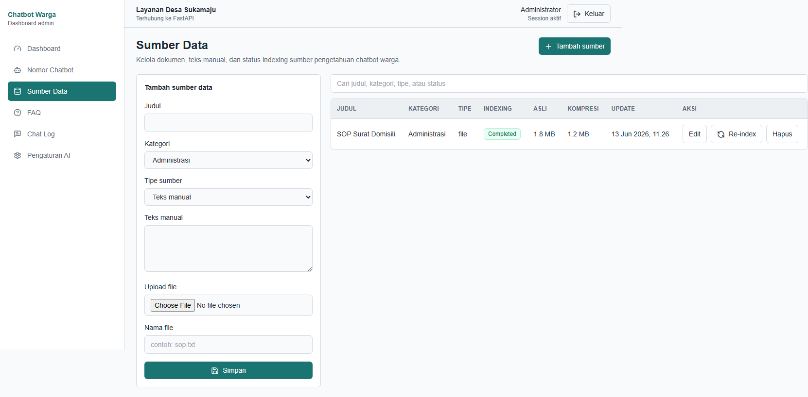
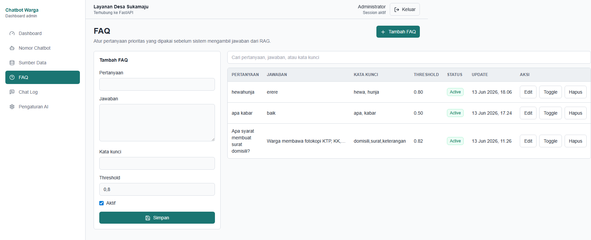
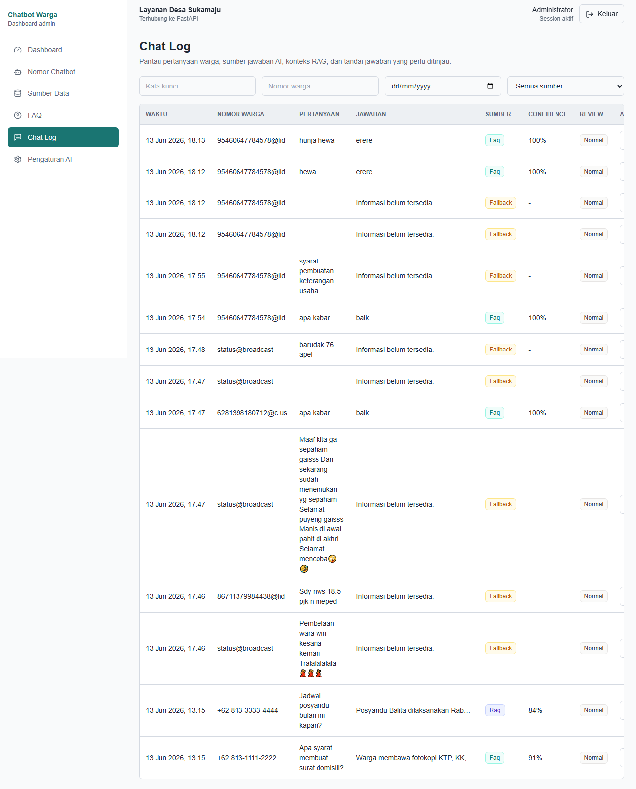
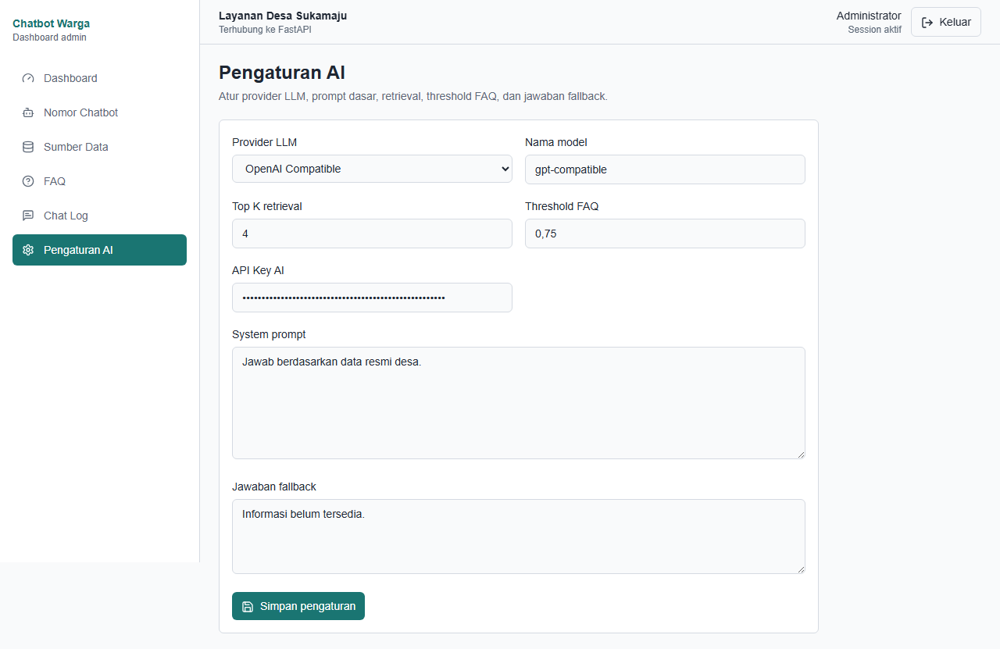

# Chatbot Warga

Chatbot Warga adalah aplikasi dashboard admin untuk layanan WhatsApp desa. Sistem ini membantu admin menghubungkan nomor chatbot, mengelola FAQ prioritas, mengunggah sumber data untuk RAG, memantau log percakapan warga, dan mengatur konfigurasi AI dari satu panel operasional.

## Isi Sistem

Repository ini berisi tiga service utama:

| Service | Lokasi | Fungsi |
| --- | --- | --- |
| Backend API | `apps/api` | FastAPI untuk autentikasi admin, CRUD data dashboard, pengolahan dokumen, reply engine, dan endpoint internal WhatsApp. |
| Web dashboard | `apps/web` | Next.js dashboard admin untuk login, monitoring, CRUD, dan pengaturan AI. |
| WA connector | `apps/wa-connector` | Connector WhatsApp Web JS untuk pairing QR dan meneruskan pesan warga ke backend. |

## Section Dashboard

### 1. Login Admin

Halaman login menjadi pintu masuk admin. Admin memasukkan email dan password yang dikonfigurasi melalui environment backend. Setelah berhasil, frontend menerima token akses untuk mengambil snapshot data dari API.



### 2. Dashboard

Section Dashboard menampilkan ringkasan operasional: jumlah chat hari ini, jawaban dari FAQ, jawaban dari RAG, sumber data aktif, nomor chatbot aktif, grafik chat harian, dan tabel pertanyaan terbaru.



### 3. Nomor Chatbot

Section Nomor Chatbot dipakai untuk menambah, mengedit, mengaktifkan, menonaktifkan, dan menghapus nomor WhatsApp chatbot. Panel ini juga menyediakan status koneksi, tombol hubungkan, refresh status, putus koneksi, serta area QR untuk pairing WhatsApp Web.



### 4. Sumber Data

Section Sumber Data mengelola basis pengetahuan chatbot. Admin dapat menambah teks manual, upload file teks, mengatur kategori, melihat status indexing, membandingkan ukuran asli dan hasil kompresi, serta menjalankan re-index.



### 5. FAQ

Section FAQ berisi pertanyaan prioritas yang dicek sebelum sistem memakai RAG. Setiap FAQ memiliki pertanyaan, jawaban, kata kunci, threshold kecocokan, status aktif/nonaktif, dan aksi edit, toggle, atau hapus.



### 6. Chat Log

Section Chat Log menampilkan riwayat pertanyaan warga, jawaban chatbot, sumber jawaban, confidence score, dan status review. Admin dapat memfilter berdasarkan kata kunci, nomor warga, tanggal, atau sumber jawaban, lalu membuka detail chat untuk melihat konteks RAG dan menandai jawaban yang perlu ditinjau.



### 7. Pengaturan AI

Section Pengaturan AI mengatur provider LLM, nama model, API key, jumlah retrieval `topK`, threshold FAQ, system prompt, dan jawaban fallback ketika informasi belum tersedia di sistem.



## Alur Kerja WhatsApp

1. Admin login ke dashboard.
2. Admin menambahkan nomor pada section `Nomor Chatbot`.
3. Admin klik `Hubungkan`, lalu scan QR WhatsApp Web yang tampil.
4. Pesan warga masuk melalui WA connector.
5. Backend menyimpan chat dan memilih jawaban dari FAQ aktif, konteks RAG, atau fallback answer.
6. Admin memantau hasil jawaban di `Dashboard` dan `Chat Log`.

## Run Manual Tanpa Docker

Salin `.env.example` ke `.env`, lalu ganti nilai rahasia seperti `ADMIN_PASSWORD`, `JWT_SECRET`, dan `INTERNAL_API_TOKEN`. Jika `APP_ENV=production`, backend akan menolak nilai rahasia bawaan.

Siapkan dependency satu kali:

```powershell
pip install -r apps/api/requirements.txt
npm --prefix apps/web install
npm --prefix apps/wa-connector install
```

Jalankan backend, frontend, dan WA connector dalam satu terminal:

```powershell
.\scripts\dev.ps1
```

Jika memakai Git Bash:

```bash
powershell.exe -NoProfile -ExecutionPolicy Bypass -File ./scripts/dev.ps1
```

URL lokal:

| Service | URL |
| --- | --- |
| Web dashboard | `http://127.0.0.1:3000` |
| Backend API | `http://127.0.0.1:8002` |
| WA connector | `http://127.0.0.1:3010` |

Untuk stop semua service, tekan `Ctrl+C` di terminal yang menjalankan `.\scripts\dev.ps1`.

Jika port default sedang dipakai:

```powershell
.\scripts\dev.ps1 -ApiPort 8010 -WebPort 3010 -WaPort 3020
```

## Run Dengan Docker

Pastikan `.env` sudah berisi `MYSQL_ROOT_PASSWORD`, `DATABASE_URL`, `JWT_SECRET`, `INTERNAL_API_TOKEN`, dan kredensial admin. Compose akan menolak secret wajib yang kosong.

```powershell
docker compose up --build
```

Stop semua container:

```powershell
docker compose down
```
